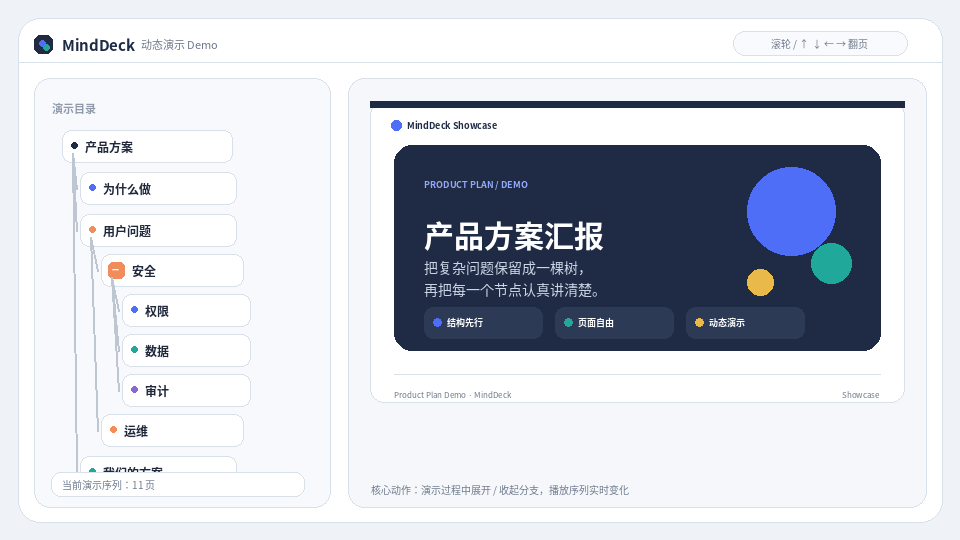

# MindDeck

**用思维导图保留整个演示结构，让每个节点又是一张真正可设计、可演示、可导出的 16:9 页面。**

> 当前版本：**V10.0.0** · Unified Runtime · SourceDocument / AI Story Planner · Editable PPTX

[在线体验](https://18611429192.github.io/minddeck/app.html) · [交互 Demo](https://18611429192.github.io/minddeck/demo.html) · [项目首页](https://18611429192.github.io/minddeck/)



## V10 架构

```text
SourceDocument / Prompt / Markdown
        ↓
Planner / AI Story Planner
        ↓
DeckPlan
        ↓
DeckSpec
        ↓
Core.Composer
        ↓
MindDeck Project / slideElements
        ↓
Shared Runtime
   ┌────┼─────────┬──────────┐
 Editor Presentation Portable PPTX Exporter
```

V10 继续坚持一套业务模型：**只有 Core.Composer 负责把 DeckSpec 编译成 MindDeck Project；Editor、Presentation、Portable 和 PPTX Exporter 都消费同一个 Project。** AI 不生成 DOM、CSS、坐标、slideElements 或 Project；PPTX Exporter 也不会从 DeckSpec 重新排版。

## V10 新能力

### SourceDocument / DeckPlan

- 统一 `SourceDocument`：plain text、Markdown、structured JSON；
- normalize / validate / JSON serializable；
- deterministic planner 作为离线、测试和 AI fallback；
- 按 `targetSlides` 控制页数，合并碎片内容并识别章节、数据、流程等内容意图；
- 稳定链路：`SourceDocument -> DeckPlan -> DeckSpec -> Core.Composer`。

### AI Story Planner

- OpenAI-compatible Provider abstraction；
- 可接 OpenAI、Qwen、DeepSeek，以及提供 OpenAI-compatible API 的 llama.cpp / vLLM / Ollama 等服务；
- Structured JSON output -> parse -> schema validation -> retry -> fallback；
- Provider 不进入 Core.Composer；
- API Key 不写入仓库、snapshot 或日志，`describe()` 只返回 `[configured] / [missing]`。

### Editable PPTX

`PptxExporter` 只接受最终 `MindDeck Project`，因此 Editor 手工移动、缩放、改字后的结果就是导出源。

- text -> PowerPoint Text；
- shape -> PowerPoint Shape；
- image -> PowerPoint Image；
- table -> PowerPoint Table；
- bar / line / area / donut -> PowerPoint native chart；
- diagram -> editable shapes + text；
- video -> 明确的 editable placeholder fallback；
- unsupported element -> warning，不静默丢弃。

PPTX 实现使用 `pptxgenjs ^4.0.1`，MIT License。详见 `docs/pptx-export.md`。

## V10 前置能力

V10 同一条 Runtime / Project 链路中还包括：Golden Baseline、Theme V2、Parametric SlideTemplate、Native Chart、Table + Diagram、Professional Template Library、Slide Inspector / DesignIntent。

## 本地开发

```bash
npm install
npm run build
npm run serve
```

然后打开 `http://localhost:8080`。

完整发布检查：

```bash
npm run release:check
```

架构审计：

```bash
npm run audit:architecture
```

真实浏览器 E2E：

```bash
npx playwright install chromium
npm run e2e
```

## 关键源码

```text
src/runtime/modules/
├─ source-document.js        # SourceDocument normalize / validate
├─ planner.js                # DeckPlan + deterministic planner
├─ ai-provider.js            # OpenAI-compatible structured planner
├─ pptx-exporter.js          # MindDeck Project -> editable PPTX
├─ composer.js               # Core.Composer 唯一 façade
├─ composer/                 # Matcher / Allocator / Compiler / Theme / Intent
├─ chart*.js                 # Native Chart
├─ structured-*.js           # Table / Diagram
├─ model.js                  # MindDeck Project model
├─ view.js                   # Shared presentation/editor rendering
└─ portable.js               # Shared portable runtime
```

## V10 文档

- `docs/architecture-v10.md`
- `docs/source-document.md`
- `docs/deck-plan.md`
- `docs/ai-provider.md`
- `docs/pptx-export.md`
- `docs/regression-v10.md`
- `docs/release-v10.md`

## 发布原则

- 不维护第二 Composer / Runtime / Project Model；
- 不在 UI 复制 Matcher / Compiler / Allocator；
- AI 只产出经过验证的 DeckPlan；
- PPTX 只从 Project 导出；
- Snapshot 变化必须区分 expected change 与 regression；
- 已知失败的 GitHub Actions 不作为反复修改正确代码的理由，也不通过删除/跳过测试换取绿灯。

## License

MindDeck 使用仓库中的 `LICENSE`。第三方依赖按各自许可证使用；PptxGenJS 为 MIT。
