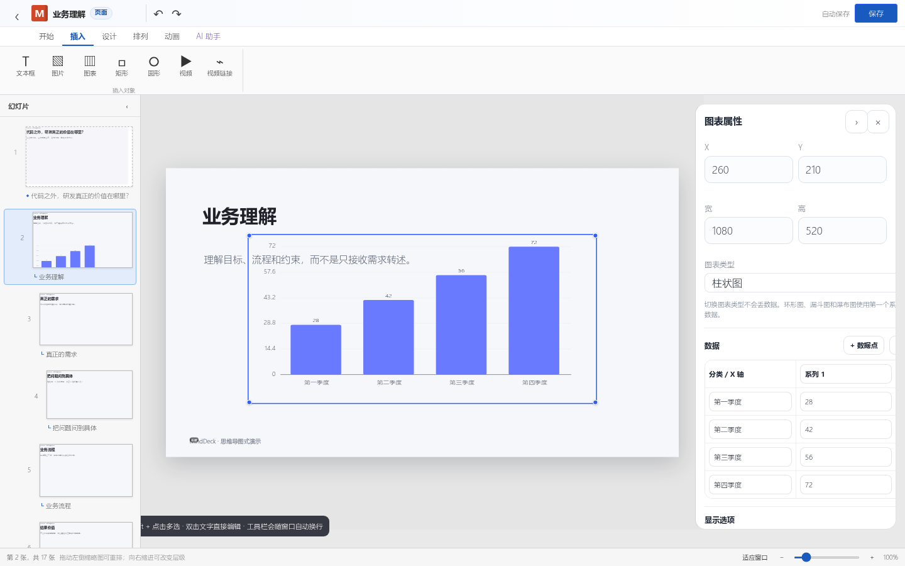

# MindDeck

MindDeck 是一个把思维导图和演示文稿放在一起的浏览器应用。

你可以先用导图整理主题和层级，再把每个节点当作一张 16:9 幻灯片编辑。导图结构、页面顺序和演示内容始终保存在同一个项目里。

[在线使用](https://18611429192.github.io/minddeck/app.html) · [交互示例](https://18611429192.github.io/minddeck/demo.html) · [项目主页](https://18611429192.github.io/minddeck/)



## 可以做什么

- 用思维导图组织整套演示的章节和层级
- 在 Office 风格的编辑器里排版文字、图片、视频、形状、表格、图表和结构图
- 通过左侧缩略图调整页面顺序；横向拖动还能改变导图层级
- 使用本机字体，设置字号、动画、对齐、图层、组合、锁定和网格吸附
- 编辑柱状图、折线图、面积图、环形图、雷达图、漏斗图和瀑布图的真实数据
- 在浏览器里直接演示，或导出项目文件、独立 HTML 和可编辑 PPTX
- 在需要时接入 OpenAI-compatible API，根据文字或 Markdown 生成演示结构，也可以修改当前页内容

## 基本用法

1. 在导图中添加节点，整理内容层级。
2. 进入“演示编辑”，从左侧选择页面。
3. 使用顶部工具栏插入内容并调整版式。
4. 点击“开始演示”检查播放效果。
5. 保存项目，或导出为 PPTX / HTML。

AI 是可选功能。未配置 API 时，导图编辑、页面设计、演示和导出仍可正常使用。AI 返回的表格、图片和图表必须包含真实数据或资源地址，不会只用占位元素伪装结果。

## PPTX 导出

PPTX 直接使用当前项目中的最终页面，因此手工移动、缩放和改字后的结果会被保留。

- 文字、形状、图片和表格会导出为对应的 PowerPoint 对象
- 常用图表会导出为原生可编辑图表
- 结构图会导出为可编辑形状和文字
- 视频和暂不支持的对象会给出明确提示，不会静默丢失
- 字体名称会写入 PPTX；本机缺少字体时会在导出前提醒

更完整的兼容说明见 [PPTX 导出文档](docs/pptx-export.md)。

## 本地运行

需要 Node.js 22 或更高版本。

```bash
npm install
npm run build
npm run serve
```

然后访问 `http://localhost:8080`。

运行完整检查：

```bash
npm run release:check
```

运行浏览器端测试：

```bash
npx playwright install chromium
npm run e2e
```

## 项目结构

MindDeck 只维护一套项目模型。无论内容来自手工编辑、Markdown 还是 API，最终都会进入同一个 Project；编辑器、演示模式、独立 HTML 和 PPTX 导出都读取这份数据。

```text
文字 / Markdown / API
        ↓
   DeckPlan / DeckSpec
        ↓
      Composer
        ↓
   MindDeck Project
     ├─ 编辑器
     ├─ 演示模式
     ├─ 独立 HTML
     └─ PPTX
```

AI 不直接生成页面 DOM、CSS 或元素坐标。页面结构先经过校验，再由 Composer 生成，这样离线模式、在线模型和导出结果使用的是同一套规则。

## 相关文档

- [首次使用](docs/first-run.md)
- [V10 架构](docs/architecture-v10.md)
- [AI Provider](docs/ai-provider.md)
- [原生图表](docs/native-chart.md)
- [表格与结构图](docs/table-diagram.md)
- [回归测试](docs/regression-v10.md)

## License

MindDeck 使用仓库中的 `LICENSE`。第三方依赖按各自许可证使用；PptxGenJS 使用 MIT License。
