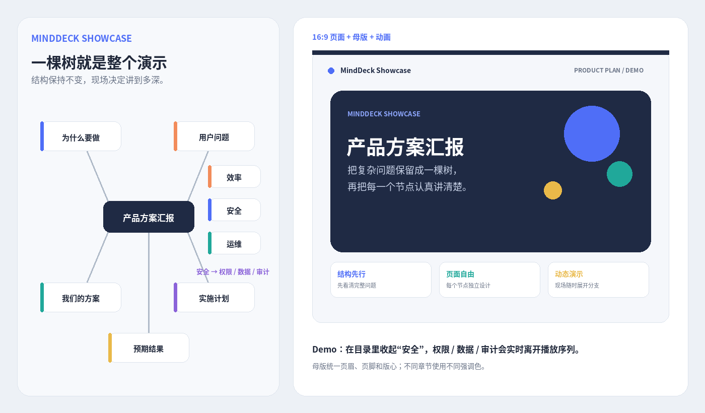

# MindDeck

**MindDeck 是一个把思维导图和演示页面放在一起的浏览器工具。**

做这个项目的原因很简单：普通 PPT 很适合一页一页讲，但很多内容本身不是一条直线，而是一棵树。

产品方案、技术架构、培训课程、项目汇报都经常这样：你既需要看见完整结构，又希望某个节点能像 PPT 一样认真排版；真正演示时，还会根据现场问题决定某个分支要不要继续展开。

MindDeck 就是为这种情况做的。



## 它是怎么工作的

MindDeck 把一份演示拆成三层：

- **思维导图**负责整个内容的结构。
- **每个节点**都是一张真正的 16:9 页面。
- **演示模式**根据当前展开 / 折叠状态决定实际播放顺序。

所以演示不一定永远是：

```text
1 → 2 → 3 → 4 → 5
```

也可以是：

```text
产品方案
├─ 为什么做
├─ 用户问题
│  ├─ 效率
│  └─ 安全
│     ├─ 权限
│     ├─ 数据
│     └─ 审计
├─ 方案
├─ 实施
└─ 结果
```

如果现场没人追问安全细节，就把“安全”收起来；如果有人临时问到数据保护，再把它展开继续讲。

不需要另一份 PPT，也不需要提前准备一堆隐藏备用页。

## 先试一下 Demo

仓库里的：

```text
examples/demo.json
```

不是测试占位文件，而是一份完整的 **产品方案汇报 Showcase**。

这份 Demo 特意把 MindDeck 目前比较重要的能力都用上了：

- 18 个节点，包含三级分支
- 左右展开的思维导图
- 一套完整母版
- 蓝 / 橙 / 青 / 紫 / 金的章节配色
- 卡片、数字、流程、架构等不同页面布局
- 淡入、浮入、缩放、左右进入等轻量动画
- 动态演示目录
- “安全 → 权限 / 数据 / 审计”三级分支

打开 MindDeck 后选择 **“打开项目”**，导入 `examples/demo.json`。

建议先进入演示，在目录里：

1. 找到“安全”
2. 把它收起来
3. 继续翻页
4. 再重新展开

这样最快能理解 MindDeck 和普通“思维导图转 PPT”工具的区别。

## 直接运行

当前完整版本仍然保留为一个单文件应用：

```text
index.html
```

直接用浏览器打开即可。

如果浏览器限制本地文件，也可以在项目目录运行：

```bash
npm run serve
```

然后访问：

```text
http://localhost:8080
```

## 现在能做什么

### 思维导图

支持左右展开、向左、向右、向下和自由放射布局，也支持曲线连接、节点拖动、展开 / 折叠、按当前可见节点重排和节点原位编辑。

折叠节点不会继续占重排空间。

### 页面编辑

每个节点都有一张独立的 `1600 × 900` 页面。

目前可以添加文字、图片、视频、形状和母版固定元素，也支持轻量动画、多选、对齐和图层调整。

手机上使用的是单独的页面编辑交互，不是把桌面工具栏硬塞到小屏幕里。

### 演示

当前展开的节点才会进入播放序列。

演示过程中仍然可以展开 / 折叠目录节点、隐藏 / 打开整个目录、跳转任意节点；手机支持左右滑动翻页。

页面始终保持真正的 **16:9**，不同分辨率只做等比缩放。

### 导出

目前支持：

- JSON 项目
- `.minddeck` 项目包
- 独立思维导图 HTML
- 独立演示 HTML
- 思维导图 + 演示融合 HTML

导出的 HTML 会保留对应的运行能力，不只是静态截图。

## 为什么还有一个 `src/`

现在完整产品仍然可以直接从 `index.html` 运行。

同时，树结构、布局、演示序列、项目诊断等逻辑正在逐步迁移到：

```text
src/
├─ core/
└─ runtime/
```

原因很现实：早期单文件版本迭代很快，但当编辑器、纯导图 HTML、演示 HTML 和融合 HTML 都开始变复杂以后，如果每一份都维护一套类似代码，很容易出现：

> 编辑器已经修好了，但导出的 HTML 还是旧逻辑。

V9 开始重点解决的就是这个问题。

## 当前状态

目前是 **V9.5 Release Candidate**。

已经停止继续堆大功能，现在优先处理正式汇报前的可靠性、编辑和导出结果一致、手机 / 桌面行为一致、大项目保存恢复和自动回归检查。

应用顶部的 **“自检”** 可以检查当前项目是否存在重复 ID、异常媒体、无效页面元素、导出风险等问题。

仓库也有自动测试：

```bash
npm test
```

需要 Node.js 18+。

## 适合什么场景

MindDeck 目前比较适合技术方案、产品设计、系统架构、培训课程、项目汇报、答辩，以及需要根据现场问题随时展开细节的演示。

它不是为了替代 PowerPoint 的所有能力。

更想解决的是：

**当你要讲的东西本身有结构时，既保留这棵结构，又把每一个节点讲清楚。**

## 反馈

项目还在 Release Candidate 阶段。

如果你真的拿它做了一次汇报，最有价值的反馈通常不是“再加一个按钮”，而是：

- 哪一步让你觉得麻烦
- 哪个操作不符合直觉
- 哪个地方让你不敢在正式会议里用
- 导出后有没有和编辑时不一致

这类问题会优先处理。
